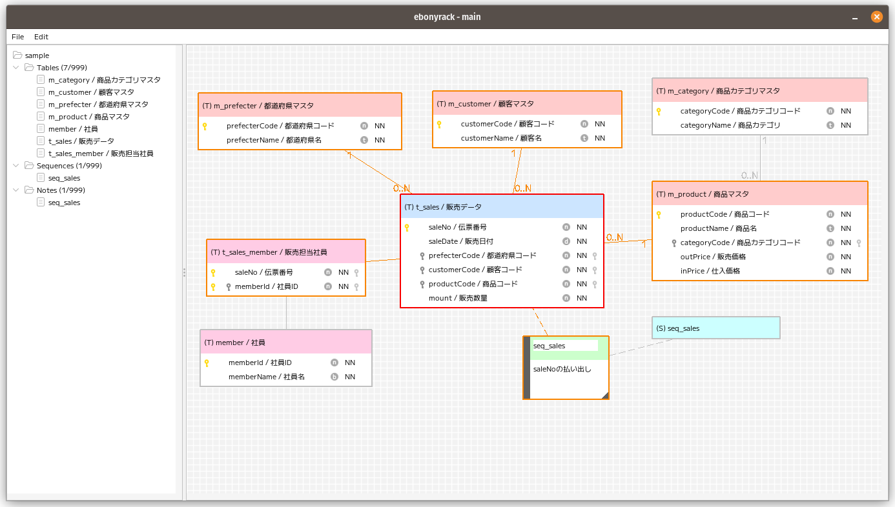
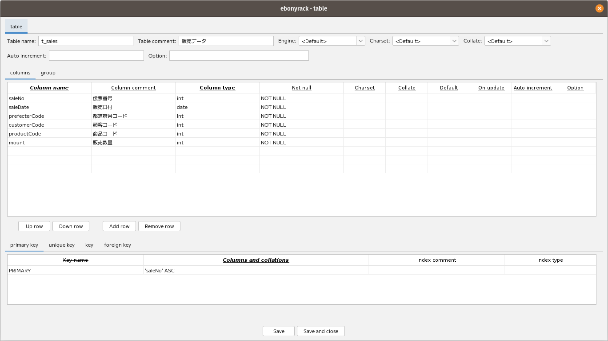

# ebonyrack

Entity relationship creation tool for MariaDB.  

### System required

* over JAVA 11

### How to run

    java -jar ebonyrack.jar

##### environment values

| NAME | VALUE | EXPLANATION                                                          |
|------|-------|----------------------------------------------------------------------|
|ER_ENV|DEBUG| If 'DEBUG', logging in detail.                                       |
|ER_HOME|{your value}| If not set, `~/.ebonyrack` directory is created and used as default. |

##### args values

| NAME | VALUE | EXPLANATION                                                           |
|------|-------|-----------------------------------------------------------------------|
|--logPath=|{your value}| Path to logging file, if 'STDOUT' or 'STDERR' was set, logging there. |
|--addSeconds=|{your value}| Default 0, it means 'UTC'.                                            |

### Dependencies

* Font: [Mplus1-Regular](https://mplusfonts.github.io/)
* Look and Feel: [FlatLaf](https://www.formdev.com/flatlaf/)