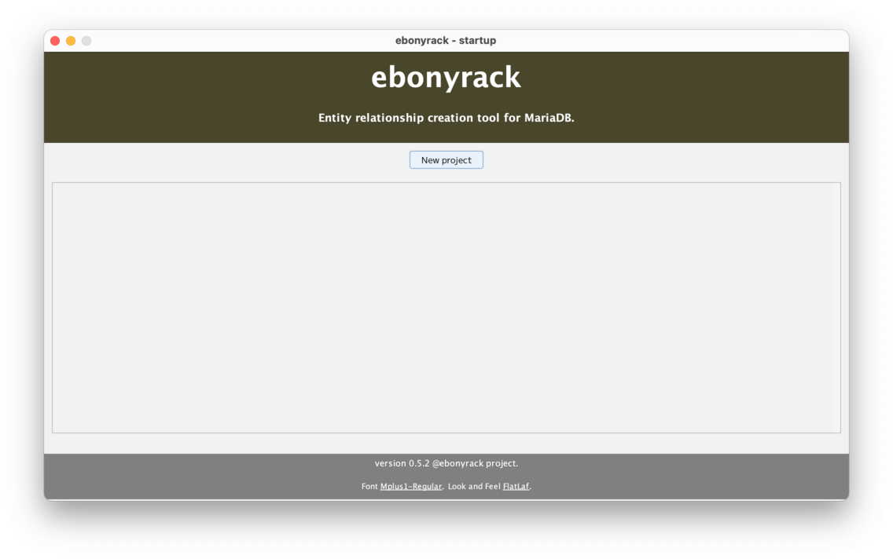
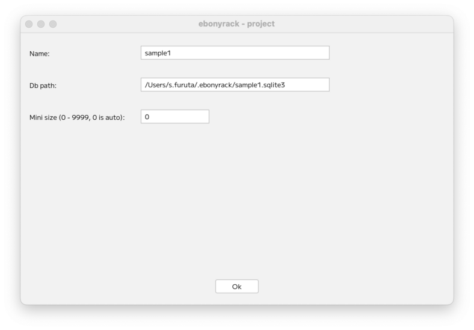
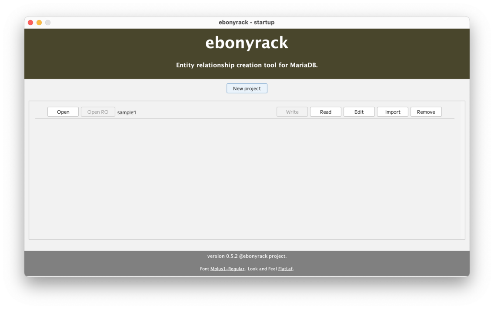
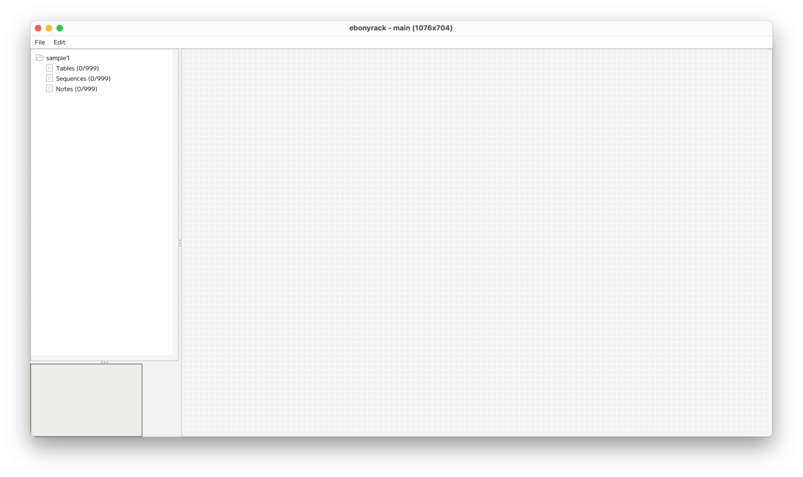

### （section01）プロジェクトの作成

ebonyrack の初回起動時は以下のような画面となります。  

ここで「New project」を押下して、新規にプロジェクトを作ります。  

「Name」はプロジェクト名となります。一意の名前を設定してください。  
「Db path」の入力欄をクリックすると、プロジェクトデータの保存先となるSQLITEファイルが選択されます。  
基本的には`プロジェクト名.sqlite3` となり、  
新規プロジェクトでは、まだSQLITEのファイルは作成されていません。  
「Mini size」は、作業場所となるワークスペースの最低サイズとなります。  
0の場合は、最低サイズがWINDOWサイズとなります。  
入力が完了したら、 __Ok__ ボタンを押下してください。  
なお、ワークスペースサイズは、可変であり、最大9999まで拡張します。  

作成したプロジェクトが一覧表示されます。  
 __Open__ ボタンを押下することで、プロジェクトが開きます。  

---

[（section02）テーブルの作成](section02.md)

[一覧に戻る](../manual.ja.md)