### (section02)テーブルの作成

プロジェクト作成直後は、何もない状態となっています。  

ここで、右側の罫線がかかった部分（ワークスペース）で、右クリックをして、  
「New table」を選択します。  

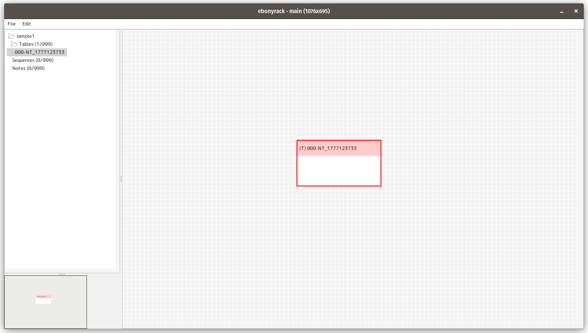

右クリックした位置に、新規にテーブルのオブジェクトが作成されます。  
テーブルの初期名は「000-NT_」という接頭辞を持ち、  
この接頭辞がついていると、各所で無効なテーブルとして扱われます。  
テーブルの詳細入力画面は、以下の動作によって開きます。  

* テーブルオブジェクトのヘッダー部分（薄赤色の部分）をダブルクリックする
* テーブルオブジェクトのヘッダー部分（薄赤色の部分）を右クリックして「Edit table」を選択する
* テーブルオブジェクトがフォーカスされている状態で、「Enter」キーを押下する

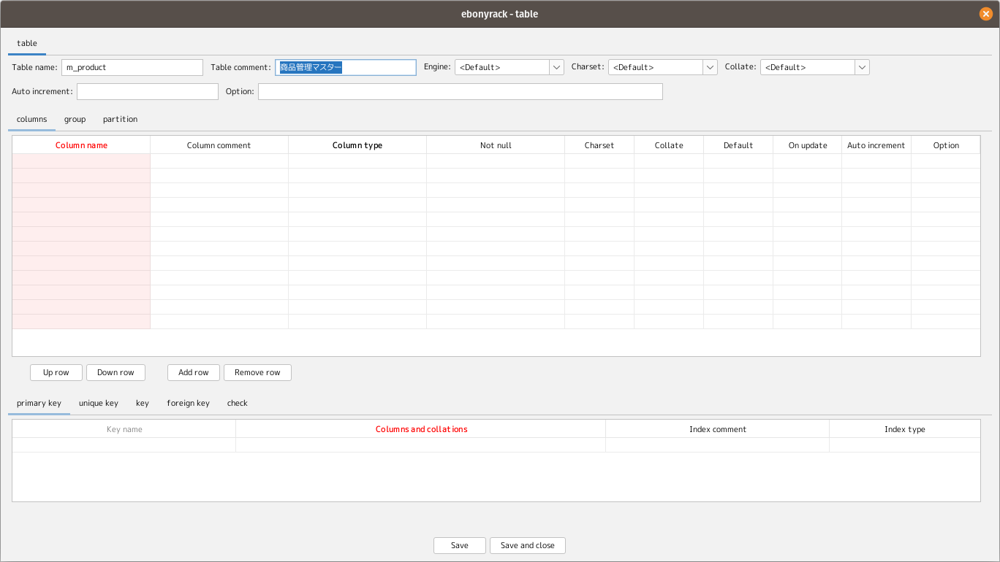

「Table name」は、いわゆる物理名で、テーブルの名前を入力します。  
「Table comment」は、いわゆる論理名で、テーブルのコメントを入力します。  
「Engine」「Charset」「Collate」は、`<Default>` にしておくことで、全体設定が適用されます。  
個別に変更する場合は、入力もしくは選択してください。  
「Auto increment」は、初期値となります。  
「Option」はテーブル構築時のオプションとなります。

次にカラムの設定をします。  
「Column name」のセルをダブルクリックすると、カラム名の入力もしくはすでに存在しているカラムの情報を参照できます。  
テーブルセルのような赤文字ヘッダーは、その列がダブルクリックによって動作することを示しています。  

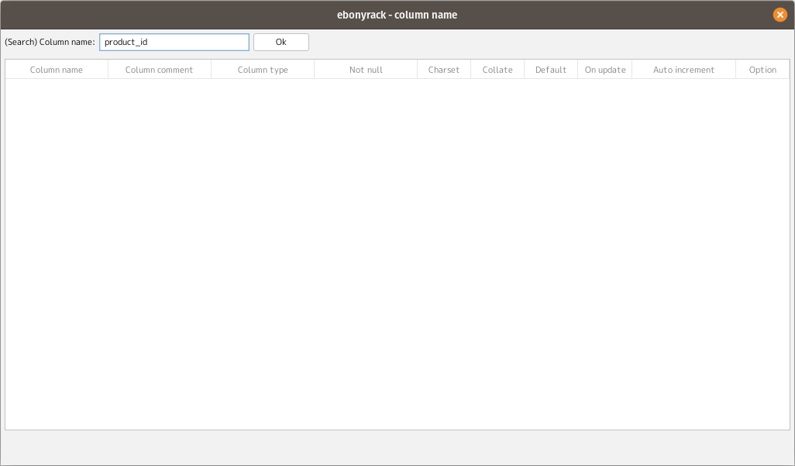

初期時点では、カラムが存在していないため、カラム名を入力して __Ok__ を押下します。  
Enterキーでも同様です。  

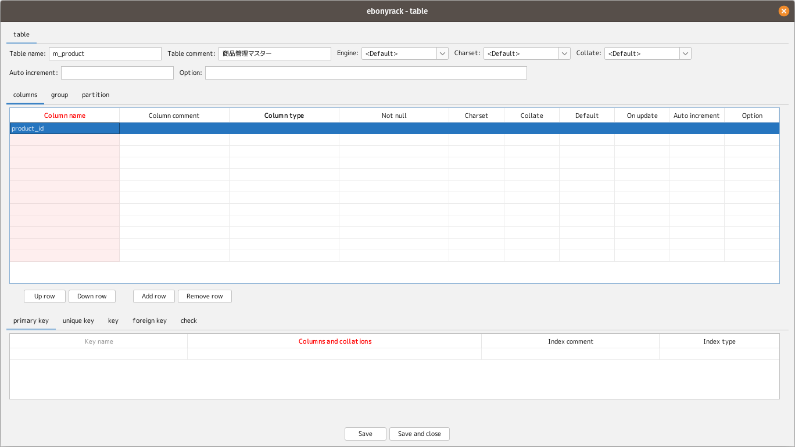

カラム名がセルに設定された状態なるので、他の項目を入力・選択していきます。  

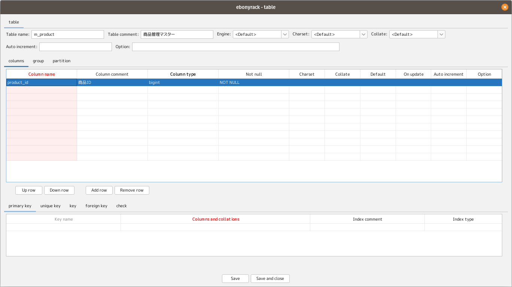

さらにカラムを追加します。  

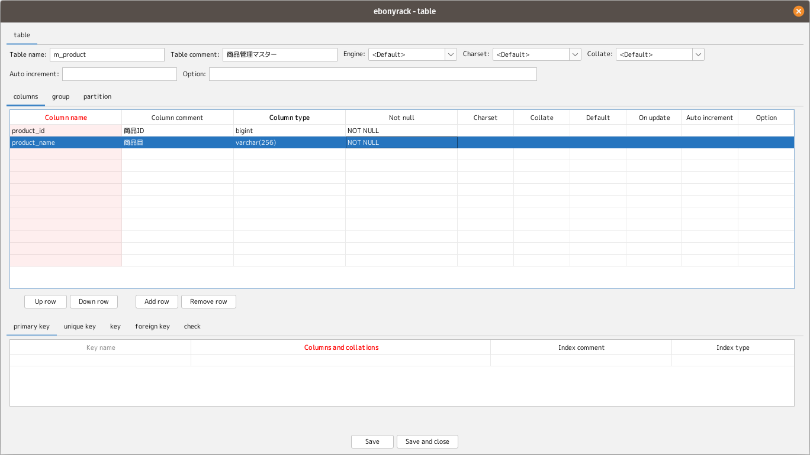

次に主キーの設定をします。  

「primary key」のタブの「Columns and collations」のセルをダブルクリックします。  

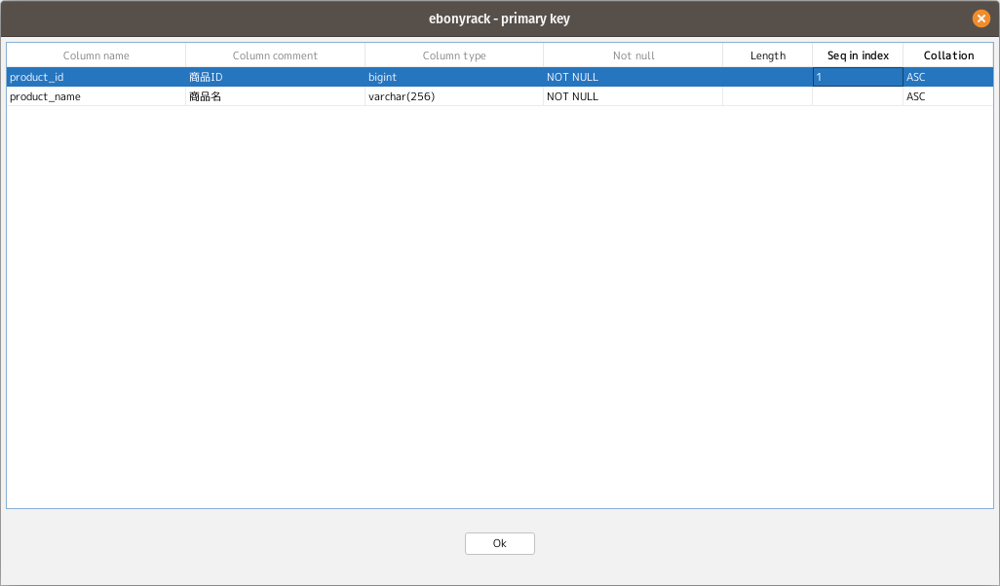

「Seq in index」で、キーの順番を指定し、 __Ok__ ボタンを押下します。  

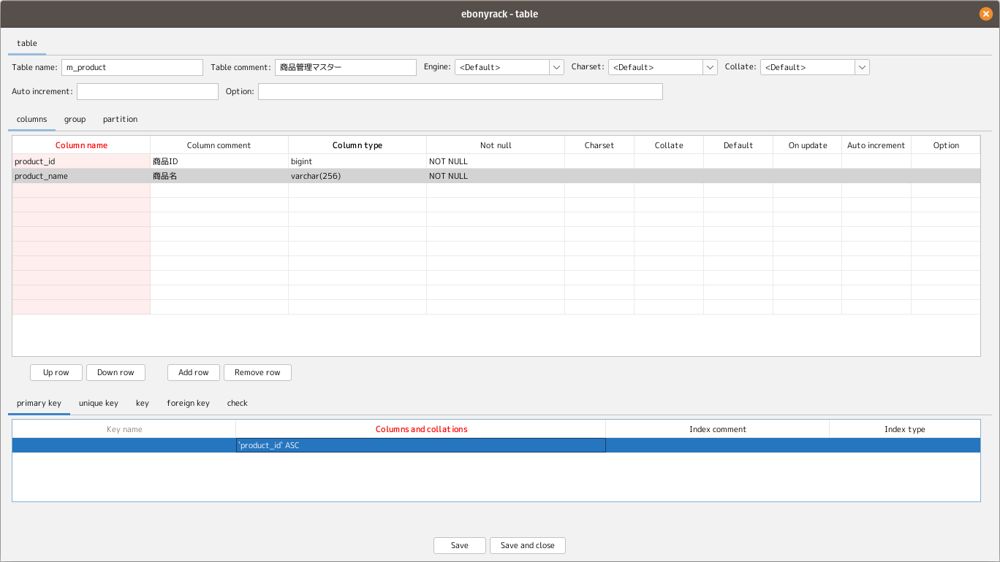

これで、主キーがセットされた状態となりました。  
「Index comment」と「Index type」は任意入力です。  

次にユニークキーの設定をします。  

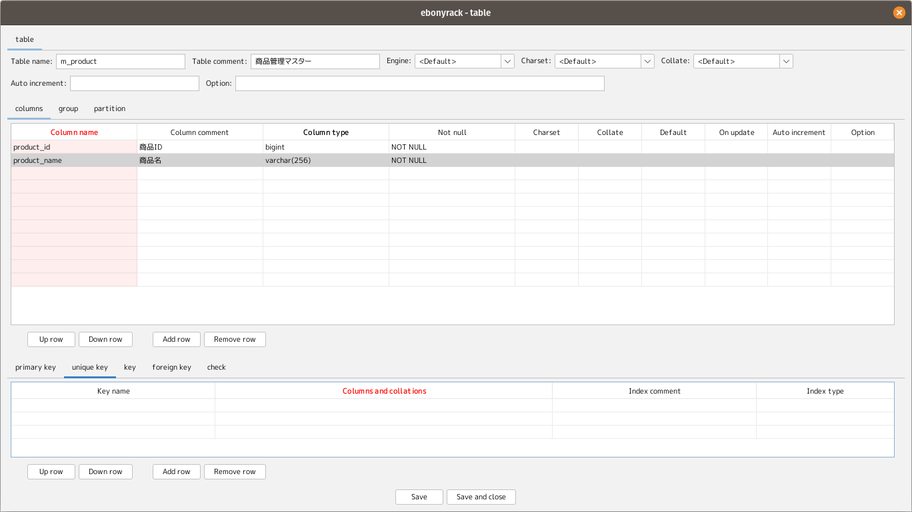

「unique key」のタブの「Columns and collations」のセルをダブルクリックします。  

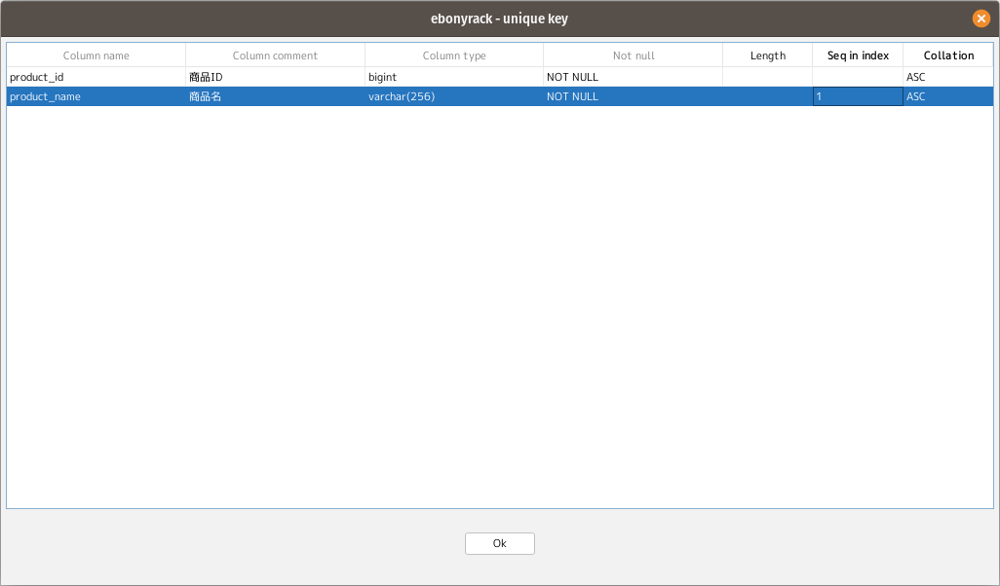

「Seq in index」で、キーの順番を指定し、 __Ok__ ボタンを押下します。  

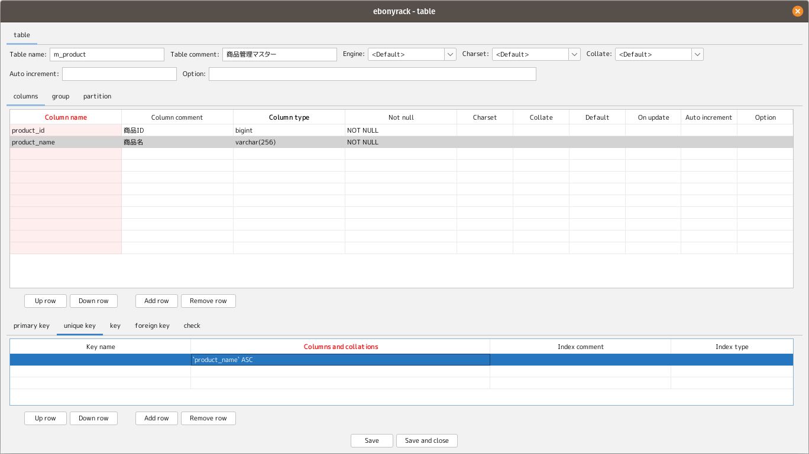

これで、ユニークキーがセットされた状態となりました。  
「Key name」は、未入力の場合、保存時にカラム名がセットされます。  
「Index comment」と「Index type」は任意入力です。  

 __Save and close__ を押下すると、  
入力したテーブルの情報がワークスペース上に表示されます。  

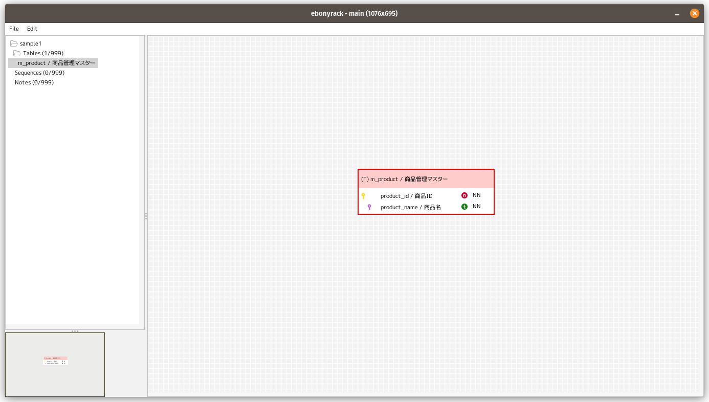

---

[(section03)シーケンスの作成](section03.md)

[一覧に戻る](../manual.ja.md)