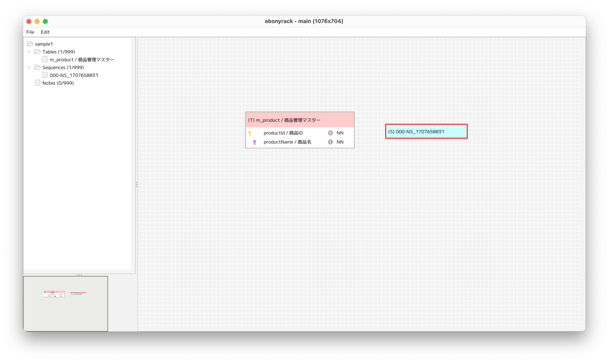
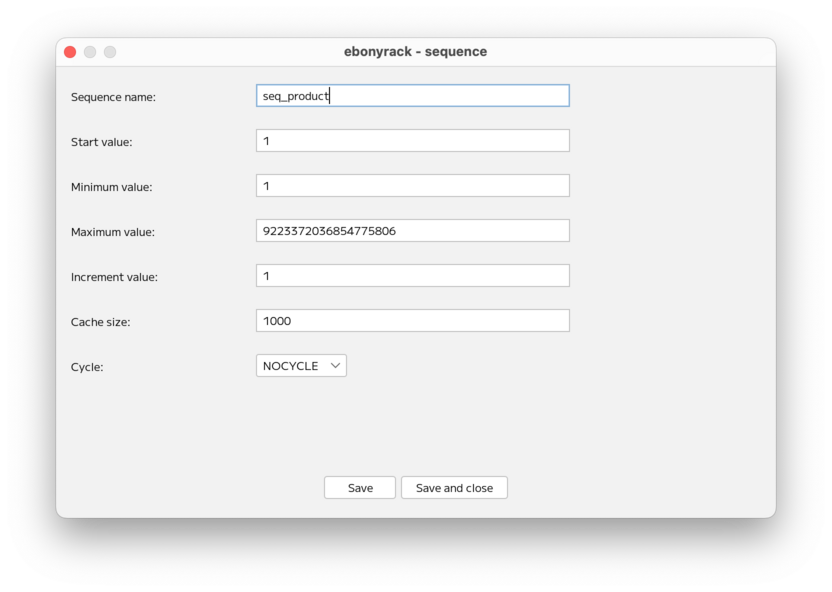
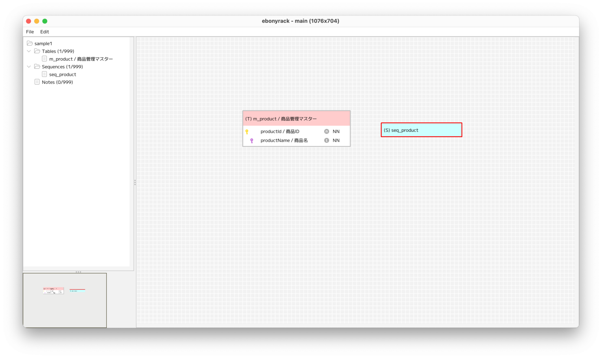

### （section03）シーケンスの作成

シーケンスを作成します。  
ワークスペースで右クリックして「New sequence」を選択します。  

右クリックした位置に、新規にシーケンスのオブジェクトが作成されます。  
シーケンスオブジェクトの水色の部分をダブルクリックすると、シーケンスの詳細入力画面が開きます。  

「Sequence name」を入力後、 __Save and close__ を押下すると、  
シーケンスの情報がワークスペース上に表示されます。  

---

[（section04）ノートの作成](section04.md)

[一覧に戻る](../manual.ja.md)