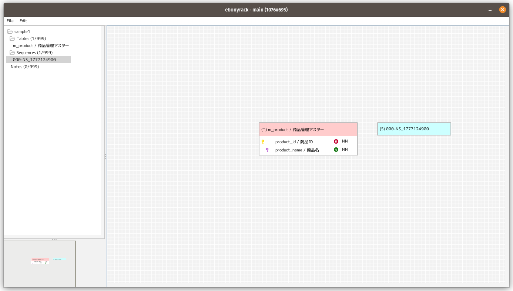
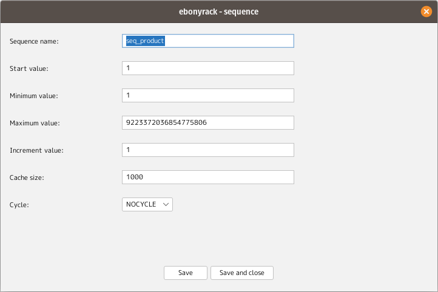
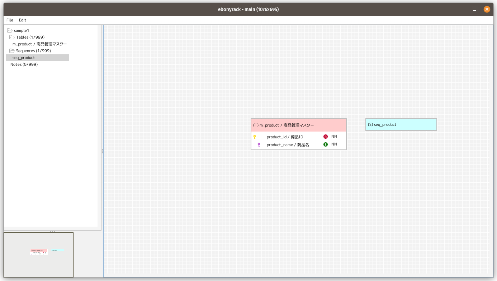

### (section03)シーケンスの作成

シーケンスを作成します。  
ワークスペースで右クリックして「New sequence」を選択します。  

右クリックした位置に、新規にシーケンスのオブジェクトが作成されます。  
シーケンスの初期名は「000-NS_」という接頭辞を持ち、  
この接頭辞がついていると、各所で無効なシーケンスとして扱われます。  
シーケンスの詳細入力画面は、以下の動作によって開きます。

* シーケンスオブジェクトをダブルクリックする
* シーケンスオブジェクトを右クリックして「Edit sequence」を選択する
* シーケンスオブジェクトがフォーカスされている状態で、「Enter」キーを押下する

「Sequence name」を変更後、 __Save and close__ を押下すると、  
入力したシーケンスの情報がワークスペース上に表示されます。  

---

[(section04)ノートの作成](section04.md)

[一覧に戻る](../manual.ja.md)