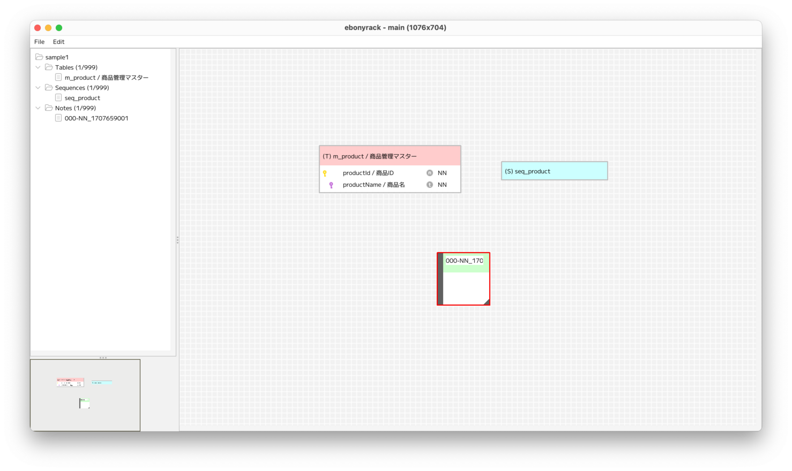
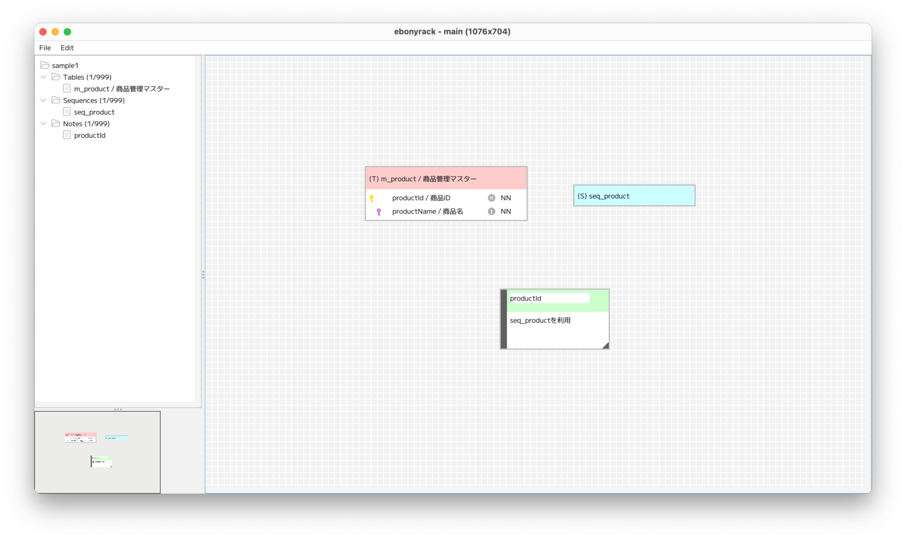
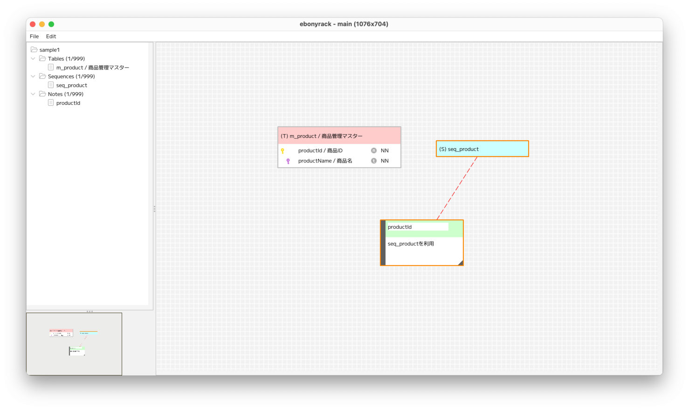
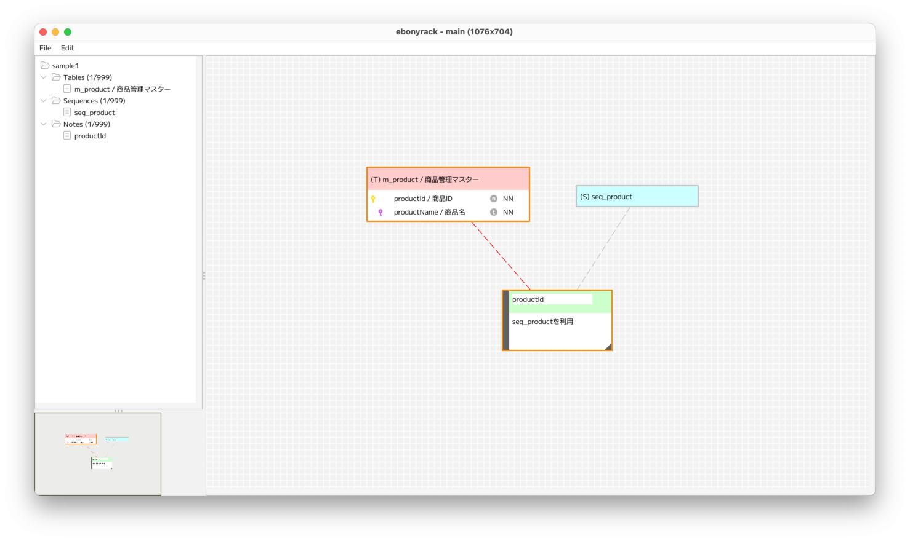

### （section04）ノートの作成

ノートを作成します。  
ワークスペースで右クリックして「New note」を選択します。  

右クリックした位置に、新規にノートのオブジェクトが作成されます。  
シーケンスの初期名は「000-NN_」という接頭辞を持ち、  
この接頭辞がついていると、各所で無効なノートとして扱われます。  

ノートは、件名（Subject）と本文（Body）が記入可能です。  
件名と本文は、フォーカスを失った段階で保存されます。  

ノートは、右下の灰色三角部分を使って、拡大縮小が可能です。  
また、左側の灰色の帯を起点に、テーブルまたはシーケンスに対してドラッグすると、  
結線することができます。  

ノートは、テーブル・シーケンスに対して結線しておくことで、  
DDL出力時に内容がDOCコメントとして表示されます。  
また、ノートの件名を結線したテーブルのカラム名としておくと、  
HTML出力時にカラムの関連情報として表示することができます。  

---

[（section05）テーブルのキー作成](section05.md)

[一覧に戻る](../manual.ja.md)