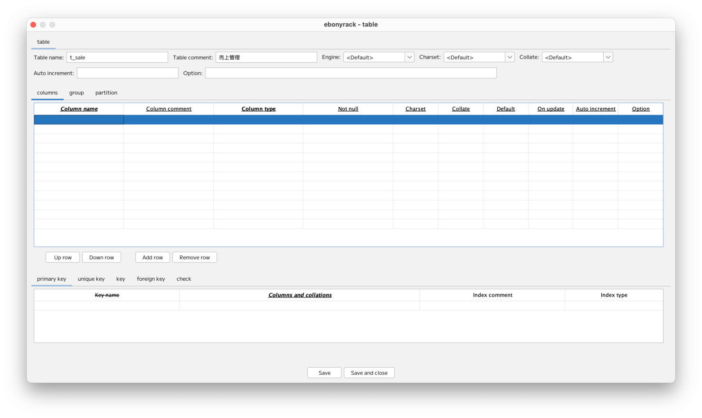

### （section05）テーブルのキー作成

テーブルを追加します。  

「Column name」のセルをダブルクリックすると、  
作成済みのカラムの情報が表示されます。  
辞書という構造を採用しているため、作成済みのカラムを再利用しやすくなっています。

ここでは、カラムを再利用せず、カラムを追加していきます。  
続けて、主キーの入力まで完了した状態にします。  

次に、キー（インデックス）を設定します。  

キー（インデックス）は、「key」タブの「Columns and collations」のセルをダブルクリックします。  

「Seq in index」で、キーの順番を指定し、 __Ok__ ボタンを押下します。  

これで、キー（インデックス）がセットされた状態となりました。  
「Key name」は、未入力の場合、保存時にカラム名がセットされます。  
「Index comment」と「Index type」は任意入力です。  

 __Save and close__ を押下すると、  
キー（インデックス）の情報がワークスペース上に表示されます。

---

[（section06）テーブルの色変更](section06.md)

[一覧に戻る](../manual.ja.md)