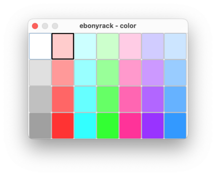
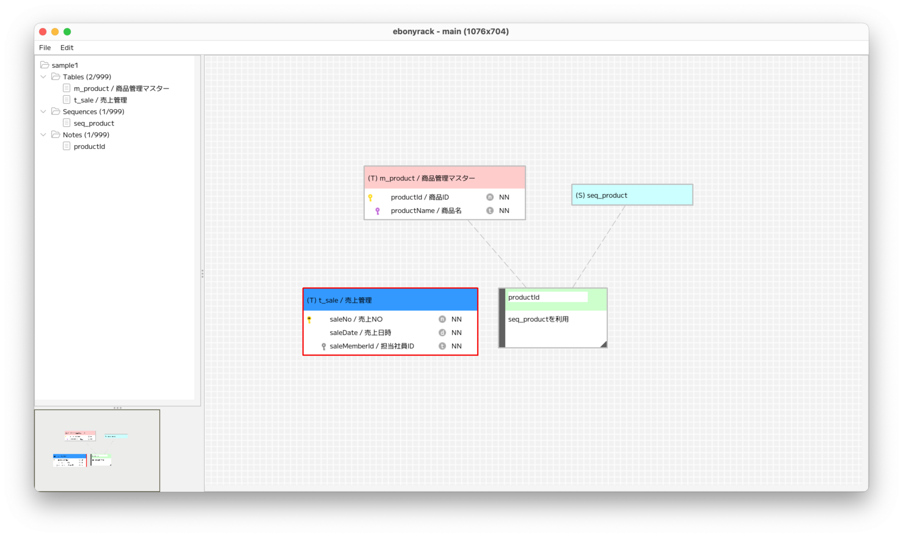

### （section06）テーブルの色変更

テーブルオブジェクトのヘッダーを右クリックして、「Choose table color」を押下します。  

色を選択すると、ダイアログが閉じて、対象テーブルの色が変更されます。  

シーケンスは全体、ノートはヘッダー部分を右クリックすると、  
同様のメニューが表示され、色の変更が可能となります。  

---

[（section07）テーブルの外部キーの作成](section07.md)

[一覧に戻る](../manual.ja.md)