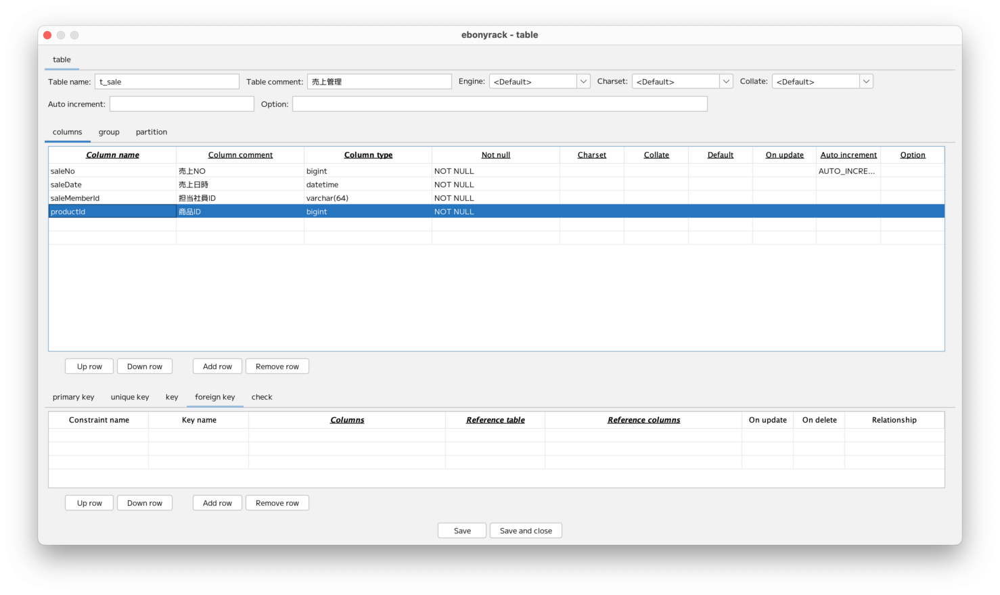

### （section07）テーブルの外部キーの作成

テーブルに外部キーを追加するための設定を行います。  
まずは、テーブルを開きます。  

カラムを追加します。  
ここではすでに存在しているカラムを再利用します。  

カラムが末尾に追加された状態になりました。  

「foreign key」のタブを開きます。

「Columns」「Reference table」「Reference columns」のセルのいずれかをダブルクリックします。

上段が参照元テーブルの情報で、下段が参照先テーブルの情報となります。  
ここからebonyrackの独自仕様があります。  
そもそも、MySQLの仕様としては、外部キーの1番目のカラムには、キー（インデックス）が必須となります。  
ただし、キーがない場合、自動的にMySQLが作成します。  
とはいえ、外部キーは実際には使わず、リレーションの可視化のみに使いたいケースもあります。  
そのような場合に、明示的にキー（インデックス）を設定しないと、  
実際にJOINする場合にパフォーマンスが悪くなるなどの事象もあります。  
そのため、ebonyrackでは、事前にキー（主キー、ユニークキー、インデックス）の1番目があるカラムにしか、  
外部キーの1番目として設定できないようにしています。  
そのため、「Seq in index」で1が指定できるのは、「First key」に記載があるカラムだけとなります。  

一旦戻って、キー（インデックス）を設定します。  

再度、外部キー設定のため、「foreign key」のタブから、外部キー設定を行います。

また、ここでもebonyrackの独自仕様として、  
「Column type」が同一のものしか、外部キーとして設定できない、としています。  
MySQLでは、参照先のカラム型が参照元のカラム型を包括していればよいという仕様ですが、  
わかりにくいため、シンプルに同一型のみを許可する形をとっています。  

 __Save and close__ を押下すると、  
テーブルの情報がワークスペース上に表示されます。  
ここでは、外部キーの情報を使って、2つのテーブルが結線されています。  

また、外部キーの線を押下することで、関係を持ったカラムが強調表示されます。  

---

[（section08）DDL表示](section08.md)

[一覧に戻る](../manual.ja.md)