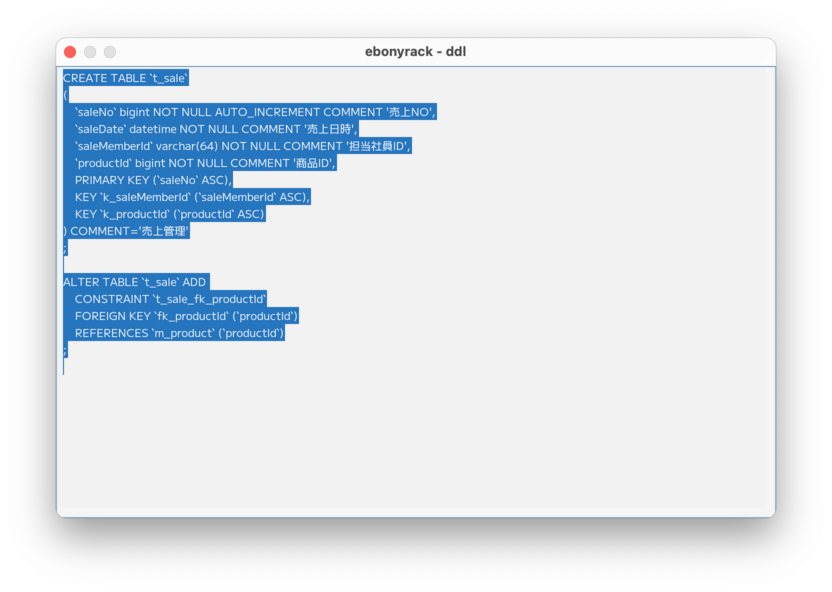

### （section08）DDL表示

テーブルオブジェクトのヘッダー部分を右クリックして、「Show table ddl」を押下します。  

`CREATE TABLE` と`ALTER TABLE ... FOREIGNKEY` の情報が表示されます。  
外部キーのDDLは、設定している場合のみとなります。  
また、ノートを結線していると、関連する情報としてDOCコメントに表示されます。  
シーケンスの場合も同様で、「Show sequence ddl」を押下することで、  
`CREATE SEQUENCE` の情報が表示されます。  
表示された情報はコピー可能なので、そのまま貼り付けて使うことができます。  

[（section09）クラス生成](section09.md)

[一覧に戻る](../manual.ja.md)