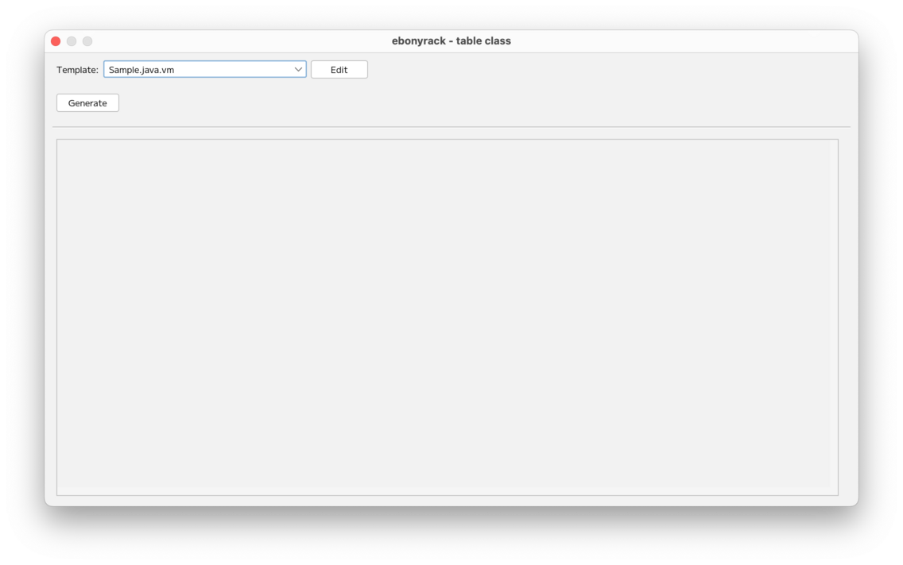
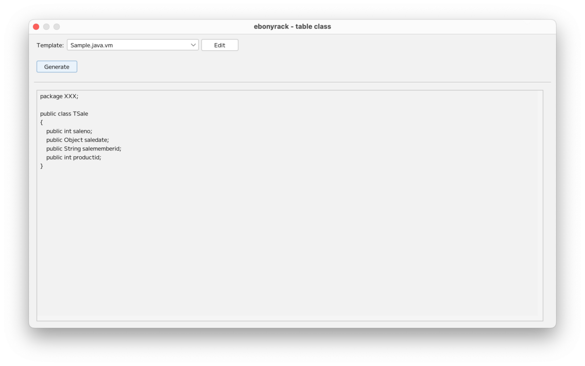

### （section09）クラス生成

テーブルオブジェクトのヘッダー部分を右クリックして、「Show table class」を押下します。  
この機能は、テーブルの定義情報に基づき、プログラムで使うクラス用のソースファイルなどを生成する機能です。  

「Generate」を押下することで、下記のようにクラス用のソースファイルが表示されます。  

「Edit」を押下すると、現在選択中のテンプレートファイルを編集できます。  
編集しつつ、「Generate」を押下することで、すぐに結果を確認することができます。  
なお、テンプレートはebonyrackのホームディレクトリ（デフォルトでは`~/.ebonyrack` ）直下の、  
`template` というディレクトリに格納することで、選択可能となります。  

ファイル名は、  

    {任意のファイル名}.{任意の拡張子}.vm

としてください。  
また、`__` で始まるファイル名はテンプレート対象外となります。  
デフォルトでは、  

* __SampleMacro.vm
* Sample.java.vm
* Sample.txt.vm

の3つが配備されています。  
Apache Velocityを使っているため、その文法に沿って情報が出力されます。  
また、「__SampleMacro.vm」は、Velocityのマクロとなっており、  
他テンプレートからも呼び出し可能となっています。  

---

[（section10）開始画面](section10.md)

[一覧に戻る](../manual.ja.md)