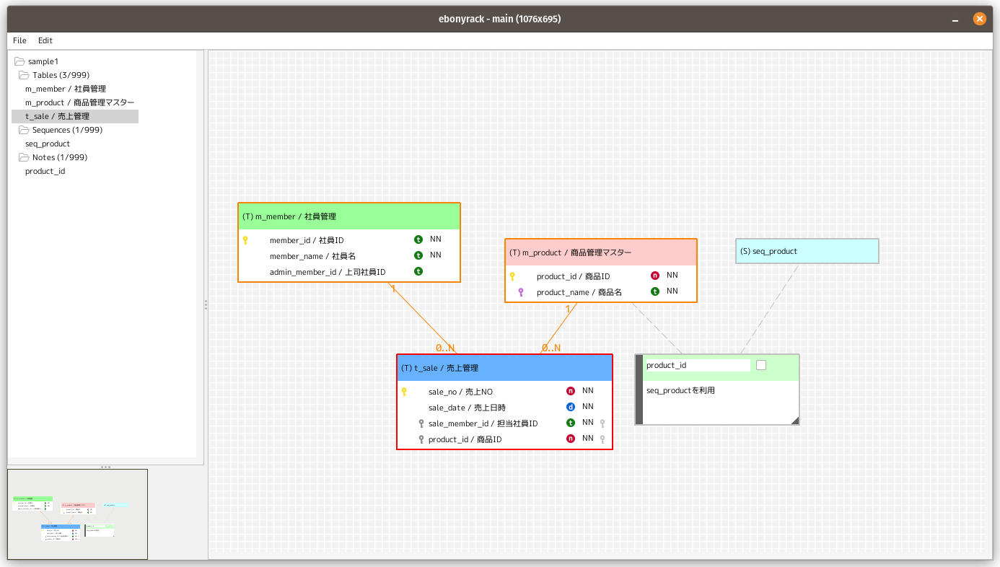
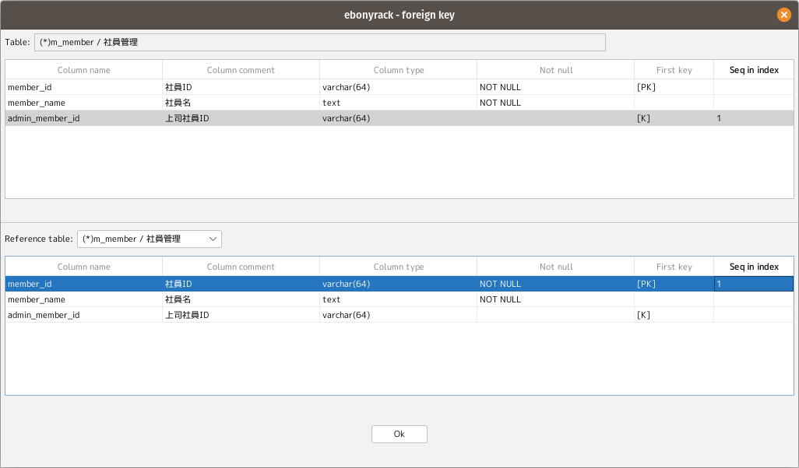
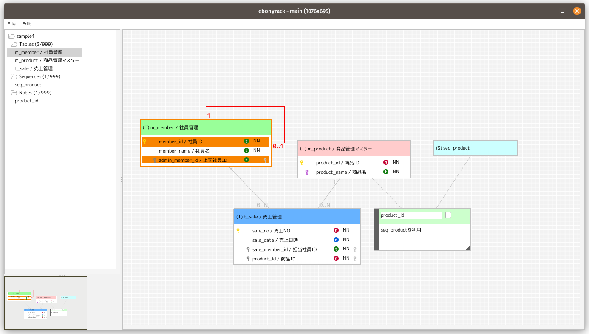

### (section09)テーブルの外部キーの自己相関

テーブルを追加し、外部キーを設定します。  

自己相関として、同一テーブルに外部キーを設定します。  

ここで、下段の「Reference table」に「`*` 」が付いているものが、  
自身のテーブルとなります。  

 __Ok__ を押下し、保存することで、  
自己相関のリレーションが表示されます。  

---

[(section10)DDL表示](section10.md)

[一覧に戻る](../manual.ja.md)
