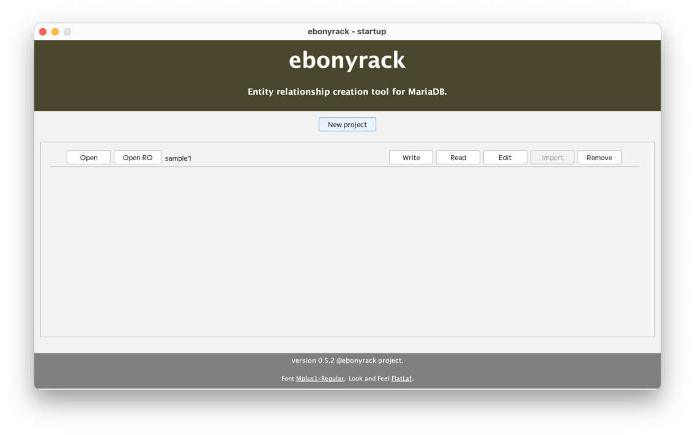

### （section10）開始画面

プロジェクトの「File」メニューから、「Close project」を選択すると、開始画面に戻ります。  
このとき、プロジェクトの表示位置・表示サイズ・ワークスペースの表示位置は保存され、  
次に開いたときに、その状態で開始されます。  

開始画面に戻ると、初期表示と異なっています。  

##### 初期状態

##### 作業後

プロジェクトの各ボタンは以下の役割となっています。  

- 「Open」ボタン  
プロジェクトを開いて、テーブルなどの設定が可能。

- 「Open RO」ボタン  
読み込み専用モードでプロジェクトを開きます。
表示上は変更可能ですが、データが保存されないため、  
閉じてから再度開くと、元に戻ります。  
初期状態では利用できません。  

- 「Write」ボタン  
プロジェクトの作業状態をJSONファイルとして出力します。  
`*.erjson` というファイル名となります。  
バージョン管理での保存用を想定しています。  
初期状態では利用できません。  

- 「Read」ボタン  
`*.erjson` というファイルから、プロジェクトの状態を復元します。  
バージョン管理からの復元用を想定しています。  
プロジェクトの内容が全て消去されますので、ご注意ください。  

- 「Edit」ボタン  
プロジェクトの設定を変更します。  

- 「Import」ボタン  
__初期状態でしか利用できません。__   
DDLを読み込ませることで、複数のテーブルとシーケンスを作成します。  
なお、テーブルのオプション・カラムのオプション・外部キーは取り込み対象外です。  
パーティション式は、整形されないので、別途整形してください。  
また、個別Importというのもあり、  
ワークスペースから1つのテーブルまたはシーケンスのDDLを読み込ませることは可能です。  
個別Importでは、プロジェクトの情報は消去されません。  

- 「Remove」ボタン  
プロジェクトの一覧から削除します。  
プロジェクトを管理しているファイル（デフォルトでは、`~/.ebonyrack/config.json` ）から削除するだけで、  
SQLITEファイルの削除はしません。  

---

[（section11）Fileメニュー](section11.md)

[一覧に戻る](../manual.ja.md)

  