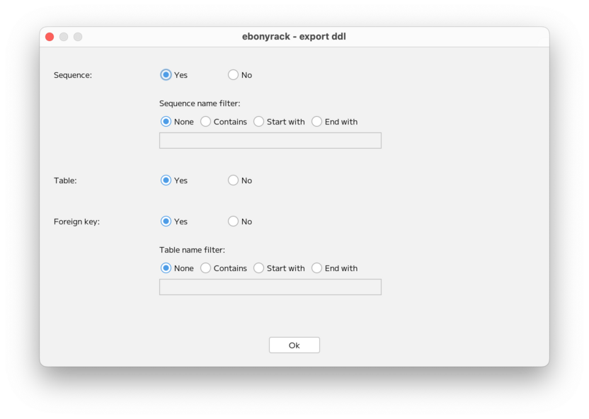
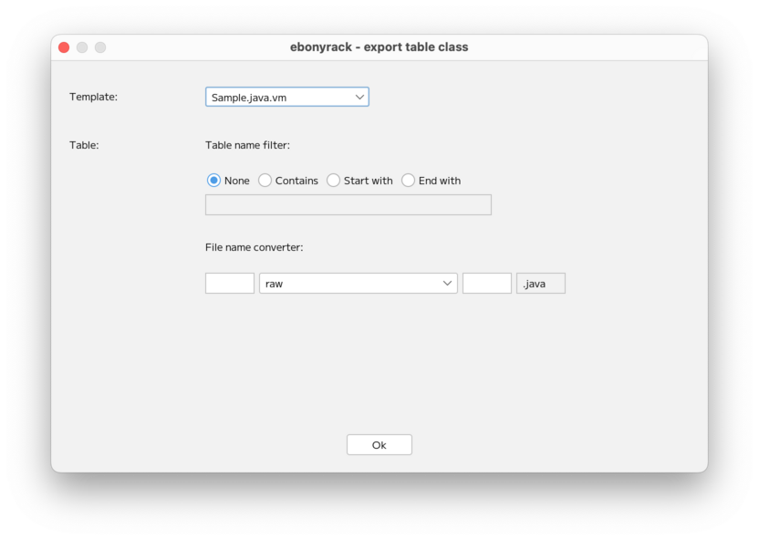

### （section11）Fileメニュー

「File」メニューには以下の項目があります。  

* Close project
* Export ddl
* Export image
* Export html
* Export table class

「Close project」は、プロジェクトを閉じて開始画面に戻ります。  
「Export image」は、希望の場所にワークスペースの画面キャプチャをPNGとして保存します。  
「Export html」は、希望の場所にHTMLドキュメントを保存します。
上記3つについては、説明を割愛します。  

「Export ddl」では、テーブルとシーケンスのDDLを出力するのですが、  
出力にあたって、条件付けが可能です。  

「Export table class」では、テーブルの情報から、  
クラス用のソースファイルを一括で出力します。  
出力にあたって、条件付けが可能です。  

また、「File name converter」では、  

    {プレフィックス}{テーブル名変換ルール}{サフィックス}.{拡張子}

というファイル名のカスタム出力が可能です。  
拡張子は、テンプレートに依存します。  
なお、出力されるファイル数はは、対象のテーブル分となります。  

---

[（section12）Editメニュー](section12.md)

[一覧に戻る](../manual.ja.md)