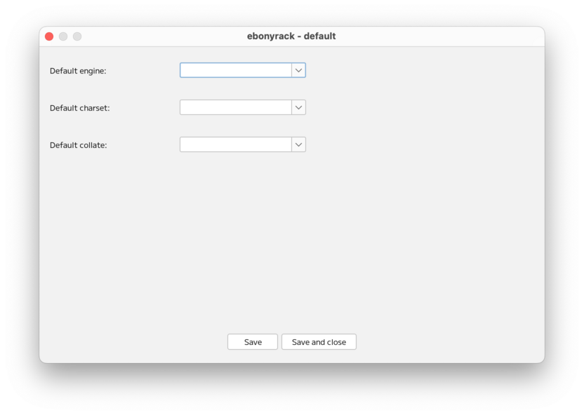
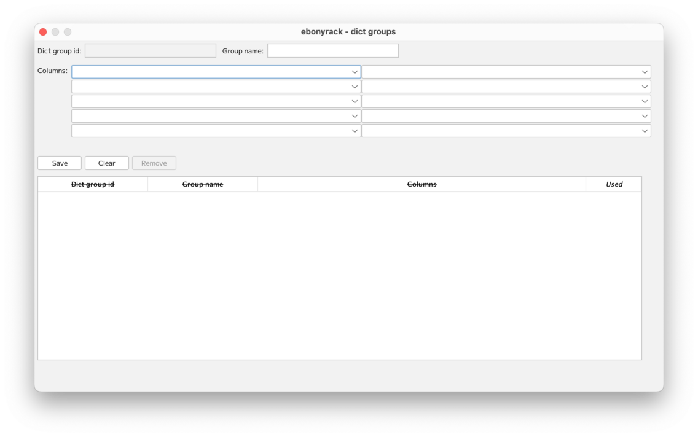

### （section12）Editメニュー

「Engine」「Charset」「Collate」のデフォルト値を設定します。  
各テーブルで、`<Default>` となっている場合、この値が採用されます。  

カラムタイプを表示・設定します。  
ここで設定されたカラムタイプのみが利用可能となります。  
不足する場合は、こちらで追加してください。  
初期状態を含め、カラムタイプが1つもない場合、プリセットが自動的に登録されます。  
「Used」が「yes」となっているものは、現在利用中のため、「Remove」（削除）はできません。  
また、「yes」をダブルクリックすると、利用中の場所の情報が表示されます。  

現在登録されているカラム情報を表示・設定します。  
ebonyrackでは、すべてのカラム情報が辞書となっており、こちらに登録されます。  
「Used」が「yes」となっているものは、現在利用中のため、「Remove」（削除）はできません。  
また、「yes」をダブルクリックすると、利用中の場所の情報が表示されます。

複数のカラムをグループとして使う場合の情報を表示・設定します。  
詳細は、[（section13）テーブルの共通カラム](section13.md) で記載します。  

パーティションの情報を表示・設定します。  
詳細は、[（section14）テーブルのパーティション](section14.md) で記載します。

---

[（section13）テーブルの共通カラム](section13.md)

[一覧に戻る](../manual.ja.md)