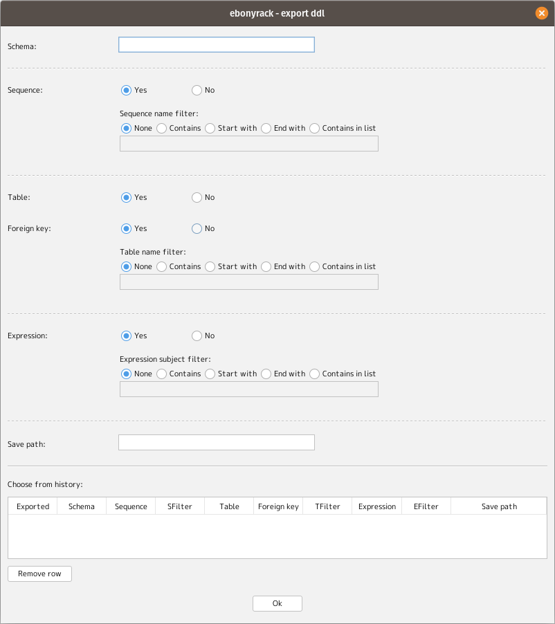
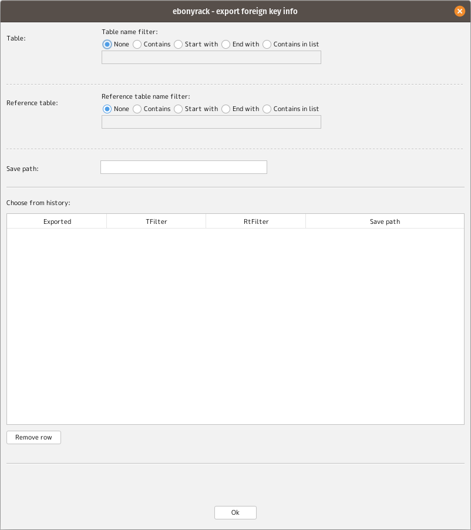
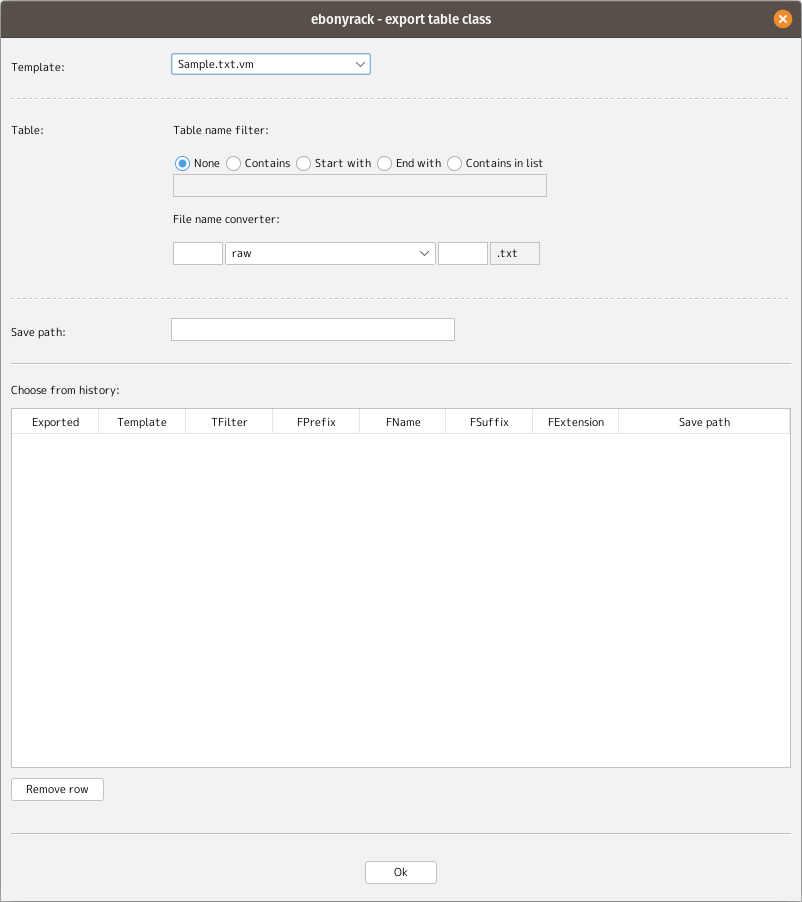

### (section13)Fileメニュー

「File」メニューには以下の項目があります。  

* Close project
* Export image
* Export html
* Export ddl
* Export foreign key info
* Export table class

「Close project」は、プロジェクトを閉じて開始画面に戻ります。  
「Export image」は、希望の場所にワークスペースの画面キャプチャをPNGとして保存します。  
「Export html」は、希望の場所にHTMLドキュメントを保存します。  
上記3つについては、説明を割愛します。  

- Export ddl  
テーブルとシーケンスのDDLを出力します。  
出力にあたって、条件付けが可能です。  
条件は履歴として、直近10件が呼び出し可能です。  

- Export foreign key info  
外部キーの情報から、テーブル同士の関係を定義したJSONファイルを出力します。  
出力にあたって、条件付けが可能です。  
条件は履歴として、直近10件が呼び出し可能です。  

- Export table class  
テーブルの情報から、クラス用のソースファイルを一括で出力します。  
出力にあたって、条件付けが可能です。  
条件は履歴として、直近10件が呼び出し可能です。  

また、「File name converter」では、  

    {プレフィックス}{テーブル名変換ルール}{サフィックス}.{拡張子}

というファイル名のカスタム出力が可能です。  
拡張子は、テンプレートに依存します。  
なお、出力されるファイル数は、対象のテーブル分となります。  

---

[(section14)Editメニュー](section14.md)

[一覧に戻る](../manual.ja.md)