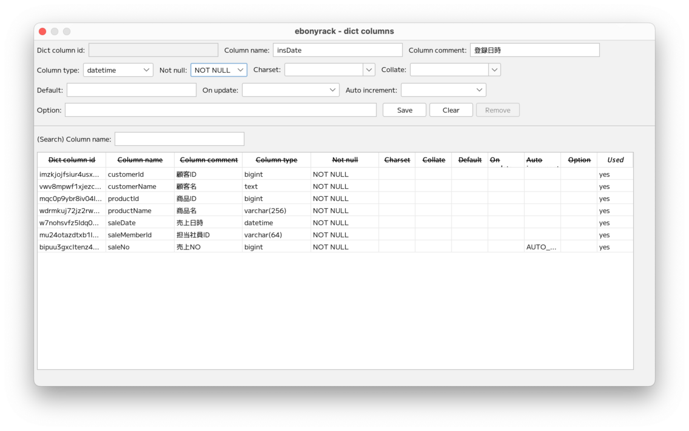

### （section13）テーブルの共通カラム

複数のテーブルで共通で使うカラムをグループ化します。

「Edit dict columns」から、2つのカラムを登録します。  

「Used」が空になっているのが新規に登録した2つのカラムとなります。  

「Edit dict groups」から、2つのカラムを1つのグループに登録します。  

登録したカラムグループをテーブルに紐付けします。  

ワークスペースでカラムグループの情報が表示されます。  
カラムグループのカラムは、灰色の文字で表示されます。  

異なるテーブルにも、同じカラムグループを紐付けします。  

---

[（section14）テーブルのパーティション](section14.md)

[一覧に戻る](../manual.ja.md)