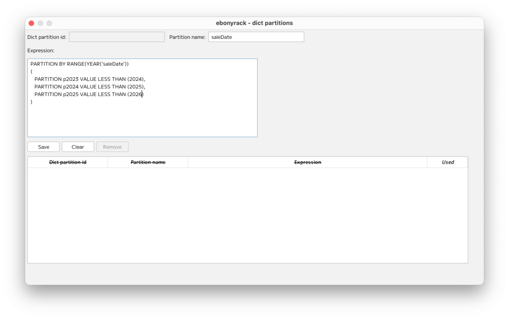
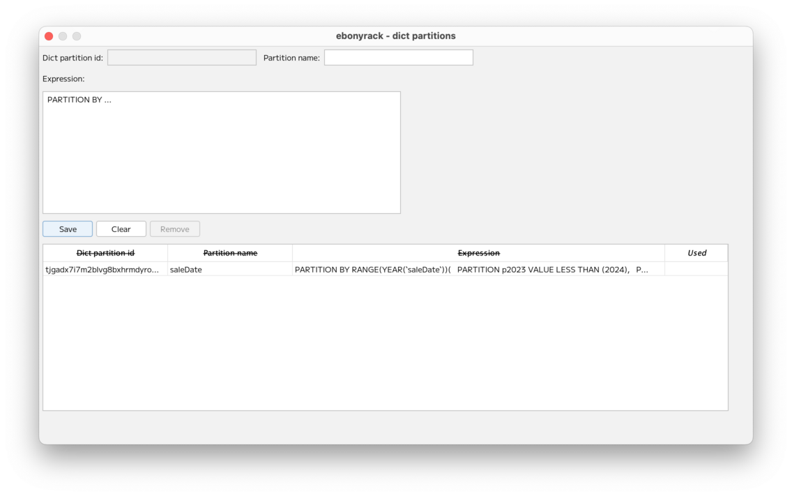
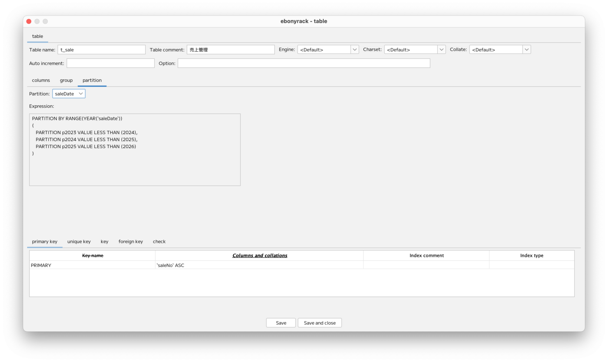
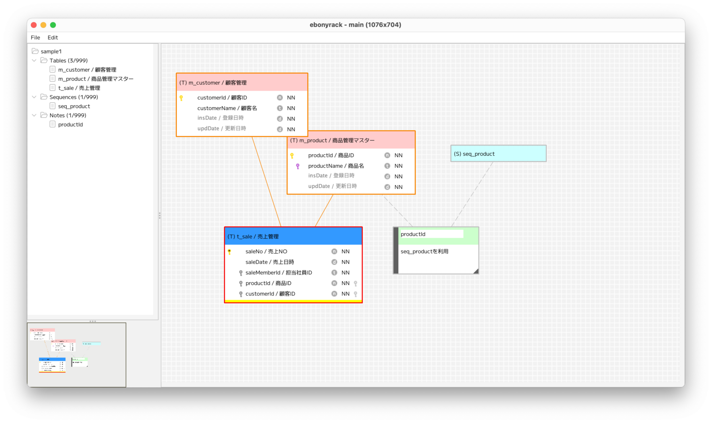

### （section14）テーブルのパーティション

パーティションは、同じ式が何度も使われることを想定しているため、  
「Edit dict partitions」から登録します。  

登録したパーティションをテーブルに登録します。  

パーティションが登録されているテーブルは、ワークスペース上で下部が黄色になります。  

---

[（section15）テーブルの外部キーの自己相関](section15.md)

[一覧に戻る](../manual.ja.md)