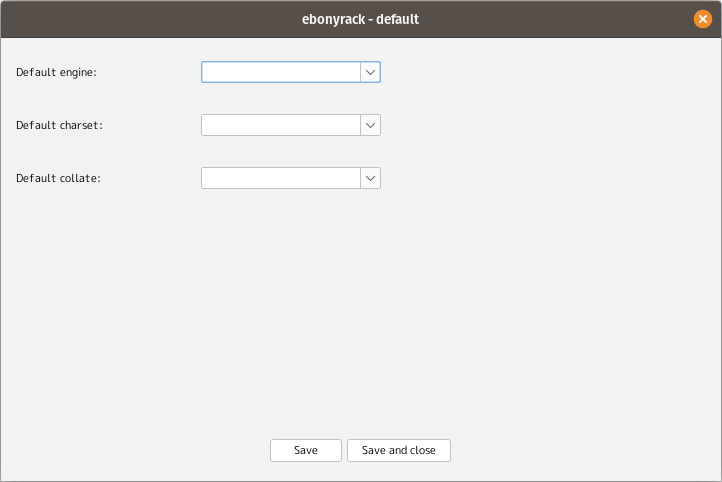
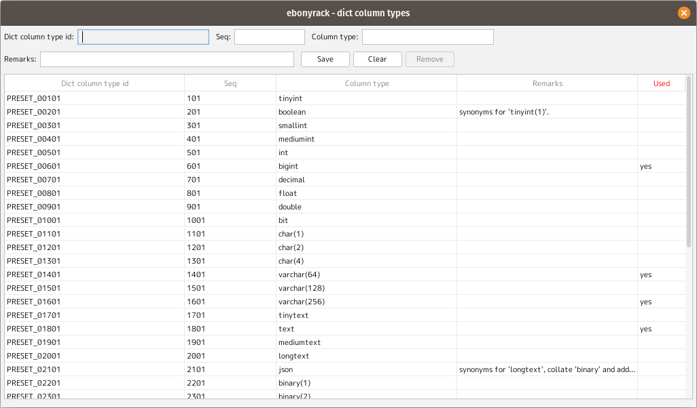
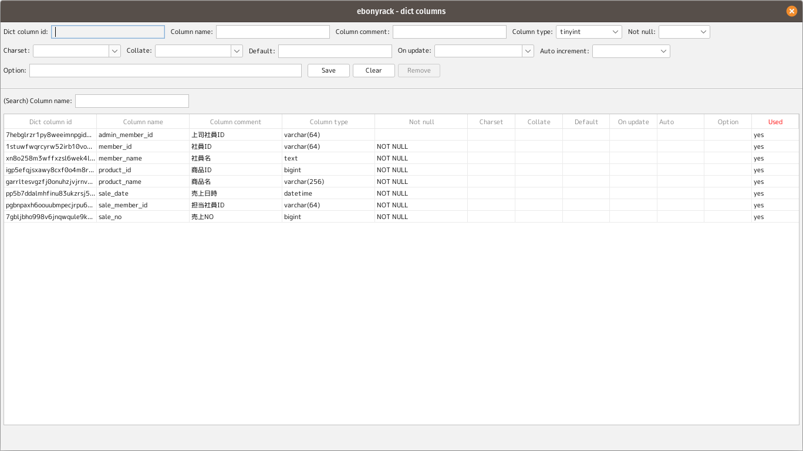
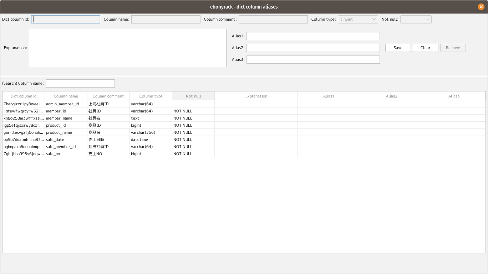

### (section14)Editメニュー

- Edit default

「Engine」「Charset」「Collate」のデフォルト値を設定します。  
各テーブルで、`<Default>` となっている場合、この値が採用されます。

- Edit dict column types  
カラムタイプを表示・設定します。  
ここで設定されたカラムタイプのみが利用可能となります。  
不足する場合は、こちらで追加してください。  
初期状態を含め、カラムタイプが1つもない場合、プリセットが自動的に登録されます。  
「Used」が「yes」となっているものは、現在利用中のため、「Remove」（削除）はできません。  
また、「yes」をダブルクリックすると、利用中の場所の情報が表示されます。  
変更する場合は、行を選択し、 __Save__ ボタンを押下してください。  

- Edit dict columns  
現在登録されているカラム情報を表示・設定します。  
ebonyrackでは、すべてのカラム情報が辞書となっており、こちらに登録されます。  
「Used」が「yes」となっているものは、現在利用中のため、「Remove」（削除）はできません。  
また、「yes」をダブルクリックすると、利用中の場所の情報が表示されます。  
変更する場合は、行を選択し、 __Save__ ボタンを押下してください。  

- Edit dict column aliases  
登録されているカラムに対して、説明やプログラムで利用する際のエイリアスを設定します。  
たとえば、データベース上では`int` の型であっても、プログラム上では`Enum` として変換したいケースなどを想定しての機能となります。  
また、こちらの内容は、カラムのDOCコメントとして出力されます。

- Edit dict groups  
複数のカラムをグループとして使う場合の情報を表示・設定します。  
詳細は、[(section15)テーブルの共通カラム](section15.md) で記載します。

- Edit dict partitions  
パーティションの情報を表示・設定します。  
詳細は、[(section16)テーブルのパーティション](section16.md) で記載します。

- Edit tables  
テーブルの一覧を表示し、編集が可能です。  
薄紫色の「Table id」の列を起点に、エクセルとのコピー＆ペイストが可能です。  

- Edit sequences  
シーケンスの一覧を表示し、編集が可能です。  
薄紫色の「Sequence id」の列を起点に、エクセルとのコピー＆ペイストが可能です。  

- Search  
「Ctr + f」でも同様の操作が可能で、  
オブジェクトの検索が可能です。  

---

[(section15)テーブルの共通カラム](section15.md)

[一覧に戻る](../manual.ja.md)