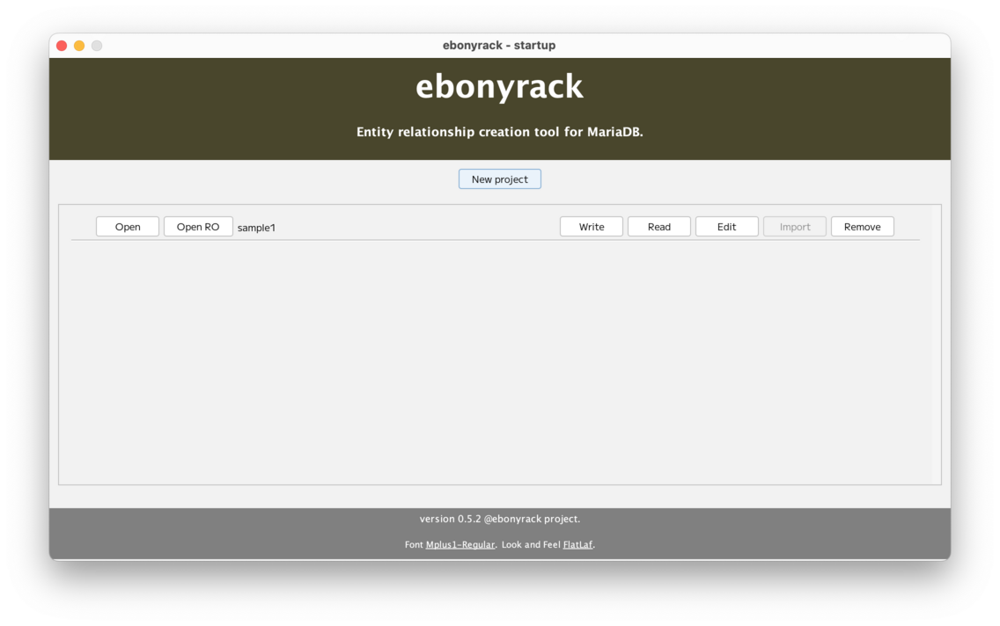
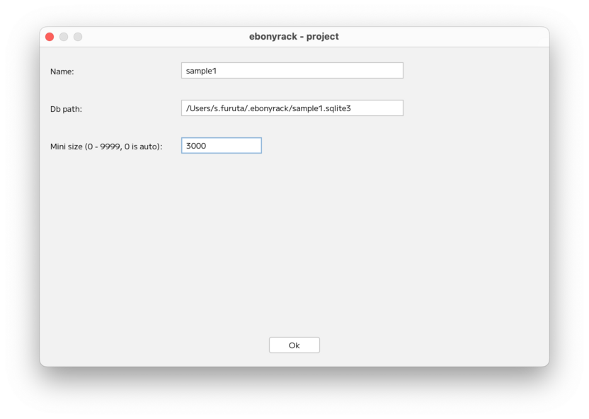
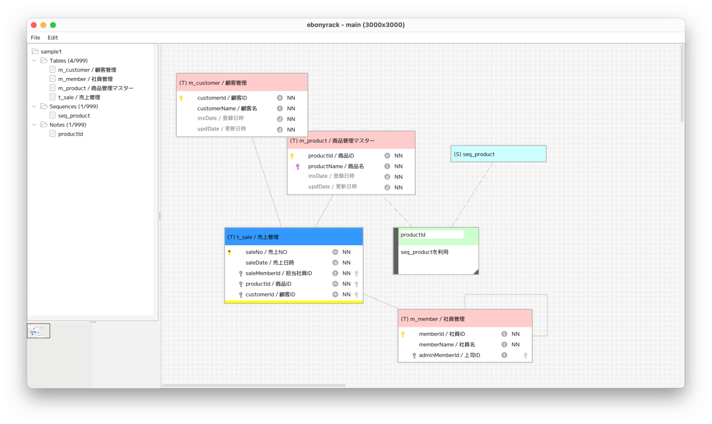
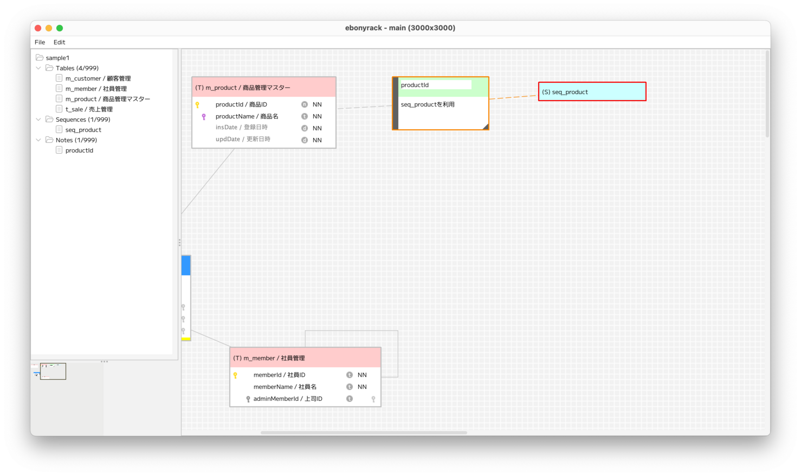

### （section16）ワークスペースの領域とアウトライン

プロジェクトを閉じて開始画面に表示します。  

「Edit」ボタンから、「Mini size」を変更します。  

プロジェクトを開くと、  
「Mini size」の変更前後で、アウトラインの大きさと、  
表示されている領域が変化していることがわかります。

##### 変更前

##### 変更後

オブジェクトを動かすなどで、ワークスペースの表示位置が変更されると、  
アウトラインの黒枠が追従します。  
なお、テーブルオブジェクトとノートオブジェクトはヘッダー部分、  
シーケンスオブジェクトは全体をドラッグすることで移動できます。  
また、アウトラインの黒枠を動かすことで、ワークスペースの表示位置も動かすことができます。  
なお、ワークスペースの拡大・縮小はありません。  
また、左側のリスト部分で各名称をクリックすると、  
当該オブジェクトにフォーカスが移り、表示領域外の場合は、ワークスペースの表示位置が移動します。  

---

[（section17）テーブルの外部キーの多重度表示](section17.md)

[一覧に戻る](../manual.ja.md)