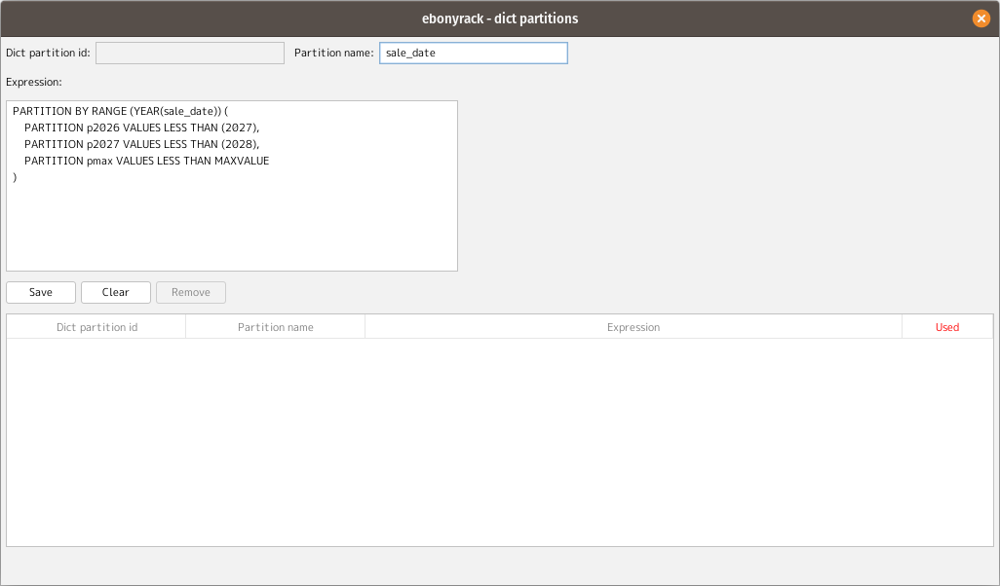
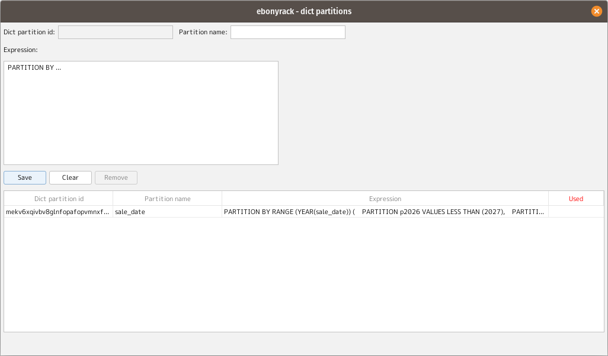
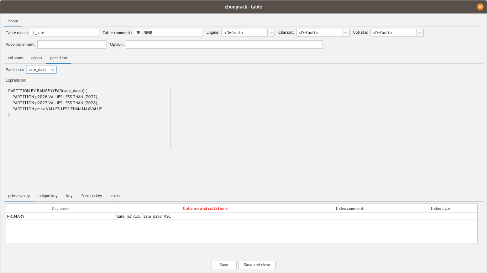
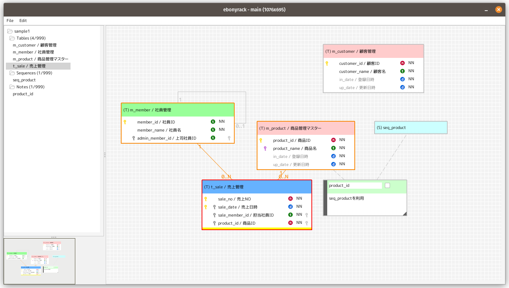

### (section16)テーブルのパーティション

パーティションは、同じ式が何度も使われることを想定しているため、  
「Edit dict partitions」から登録します。  

登録したパーティションをテーブルに紐付けします。  

パーティションが紐付けられているテーブルは、ワークスペース上で下部が黄色になります。  

---

[(section17)ワークスペースの領域とアウトライン](section17.md)

[一覧に戻る](../manual.ja.md)