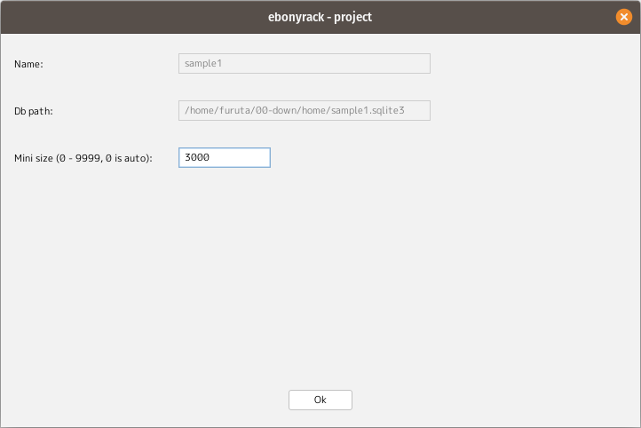
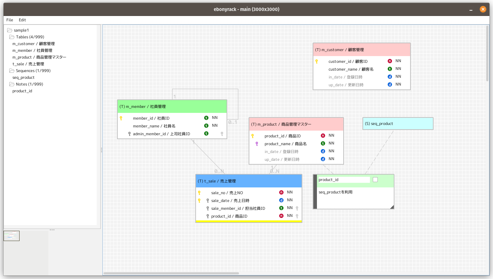
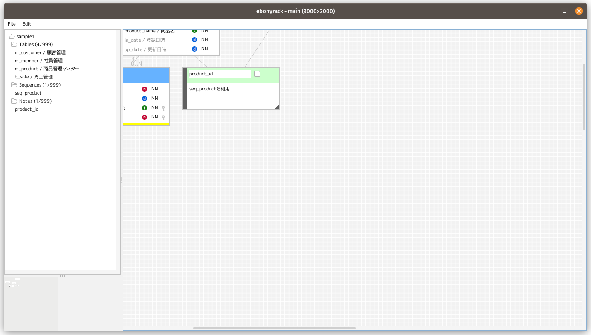

### (section17)ワークスペースの領域とアウトライン

プロジェクトを閉じて開始画面に表示します。  
「Edit」ボタンから、「Mini size」を変更します。  

プロジェクトを開くと、  
「Mini size」の変更前後で、アウトラインの大きさと、  
表示されている領域が変化していることがわかります。

##### 変更前

##### 変更後

オブジェクトを動かすなどで、ワークスペースの表示位置が変更されると、  
アウトラインの黒枠が追従します。  
アウトラインの黒枠を動かすことで、ワークスペースの表示位置も動かすこともできます。  
また、左側のリスト部分で各名称をクリックすると、  
当該オブジェクトにフォーカスが移り、表示領域外の場合は、ワークスペースの表示位置が移動します。  

---

[一覧に戻る](../manual.ja.md)